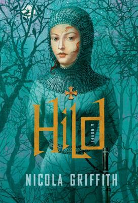
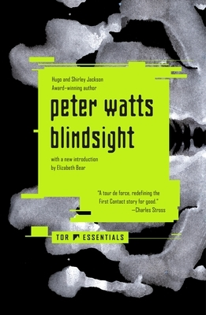
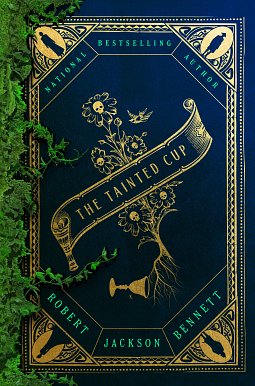

+++
date = '2025-12-31T20:15:28-08:00'
title = '2025 Books'
+++

Here are my awards for the books that jumped out at me when scanning the list of all the books I read.

I read 54 books this year, 28 of which were written by authors who were new to me, which I think is a cool stat!

---
### The Matt Prize for Best Mystery that was also About Architecture, Beauty and Intelligence 
#### [Rose/House - Arkady Martine](https://app.thestorygraph.com/books/c482b293-6a1f-4e10-993d-21d415aaec84)

---
### The Matt Prize for Best Picture into a Historical World, Full of Powerful Characters and a Thorough Evisceration of the Kind of People Who Would Be Kings
#### [Hild (and Menewood) - Nicola Griffith](https://app.thestorygraph.com/books/397a5621-0140-4cc0-bd22-4247c3fe1b8c)

---

### The Matt Prize For Woah, Literature and also The Meaning of Being a Human, also Five Stars
#### [Cloud Atlas - David Mitchell](https://app.thestorygraph.com/books/22fe15a2-ddc3-458f-b79c-e740fa8c3f9a)

---
### The Matt Prize for Now This is What SciFi is At It's Best, Still Making Me think, and Remarkably Philosophically Appropriate to Our Current Moment, Despite Being Old

#### [Blindsight - Peter Watts](https://app.thestorygraph.com/books/d094e5be-11f2-42cb-9262-9b84434d53cf)

---
### The Matt Prize for WHEN IS THE SEQUEL I WANT MORE and Also Great Fantasy Book

#### [The Raven Scholar - Antonia Hodgson](https://app.thestorygraph.com/books/86845d5b-9a34-4ad3-8578-a685a5ee4596)

---
### The Matt Prize For Overall Probably My Favorite and What I'd Recommend The Most with Empire, Cool Fantasy World, Characters with Values that Conflict, and Mystery

#### [The Tainted Cup - Robert Jackson Bennett](https://app.thestorygraph.com/books/e1def2b4-516d-47bc-a60d-7de779b4b1cb)

